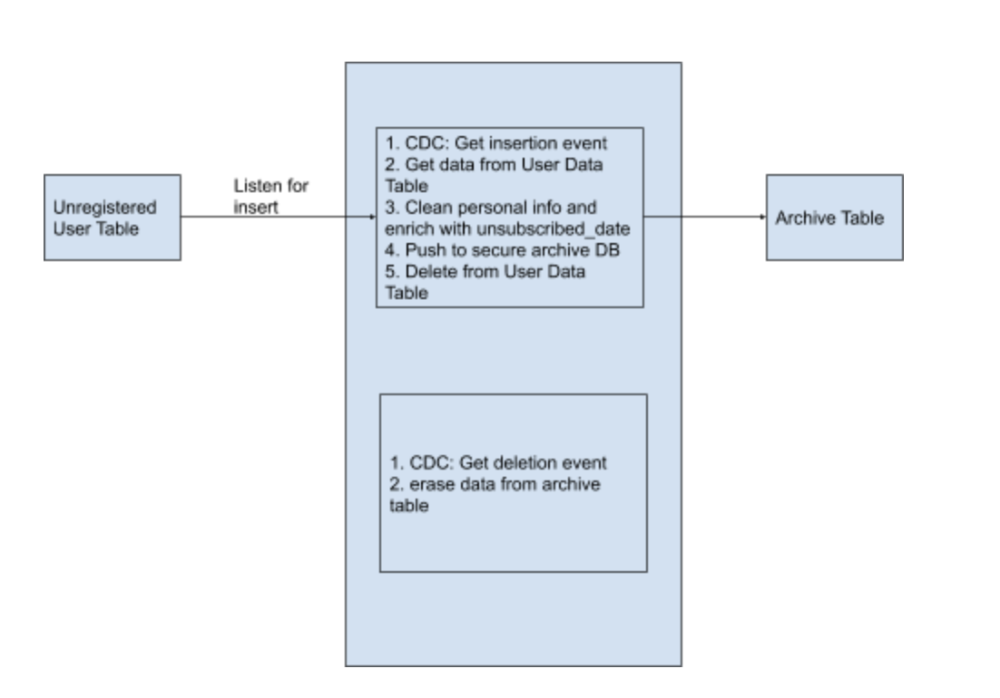

### 1. Data Warehousing with Real-time ETL

[https://gdpr.eu/eu-gdpr-personal-data/#:~:text='Personal%20data'%20means%20any%20information,location%20data%2C%20an%20online%20identifier](https://gdpr.eu/eu-gdpr-personal-data/#:~:text='Personal%20data'%20means%20any%20information,location%20data%2C%20an%20online%20identifier)

[https://gdpr-info.eu/issues/personal-data/](https://gdpr-info.eu/issues/personal-data/)

General Data Protection Regulation came into effect from May 2018 which introduces strict guidelines for companies regarding customer data. One such requirement is that companies should no longer hold onto personal data of users when the user terminates his relationship with the company. This can be deletion of a social media account, cancellation of a service subscription etc. However, all data pertaining to the user cannot simply be deleted. There is certain data that needs to be archived for a few years for future legal purposes. Consider the example below,

The following is part of user data of an online entertainment platform,

<table>
  <tr>
   <td>user_id
   </td>
   <td>username
   </td>
   <td>reg_date
   </td>
   <td>package
   </td>
   <td>address
   </td>
   <td>mobile_number
   </td>
  </tr>
  <tr>
   <td>001
   </td>
   <td>thomasdrayton
   </td>
   <td>1597656676
   </td>
   <td>movies
   </td>
   <td>3120  Doctors Drive, Los Angeles, CA
   </td>
   <td>310-391-2096
   </td>
  </tr>
  <tr>
   <td>002
   </td>
   <td>jenniferhill
   </td>
   <td>1597638642
   </td>
   <td>tv_series
   </td>
   <td>1524  Retreat Avenue, Portland, ME
   </td>
   <td>207-332-3446
   </td>
  </tr>
  <tr>
   <td>...
   </td>
   <td>...
   </td>
   <td>...
   </td>
   <td>...
   </td>
   <td>...
   </td>
   <td>...
   </td>
  </tr>
</table>

If the user with user_id 001 cancels his subscription, we can delete the first row. However, we need to retain user_id, subscribed_date, subscribed_services along with unsubscribed_date for future legal queries. For this we use an intermediate table called UnregisteredUserTable. We will insert user_id, username, and status into this new table.

<table>
  <tr>
   <td>user_id
   </td>
   <td>username
   </td>
   <td>status
   </td>
  </tr>
  <tr>
   <td>001
   </td>
   <td>thomasdrayton
   </td>
   <td>unregistered
   </td>
  </tr>
  <tr>
   <td>...
   </td>
   <td>...
   </td>
   <td>...
   </td>
  </tr>
</table>

<table>
  <tr>
   <td>user_id
   </td>
   <td>reg_date
   </td>
   <td>unreg_date
   </td>
   <td>package
   </td>
  </tr>
  <tr>
   <td>001
   </td>
   <td>1597663814
   </td>
   <td>1597656676
   </td>
   <td>movies
   </td>
  </tr>
  <tr>
   <td>...
   </td>
   <td>...
   </td>
   <td>...
   </td>
   <td>...
   </td>
  </tr>
</table>

#### 1.1 Setup

##### 1.1.1 MySQL

CREATE TABLE UserDataTable (

user_id INT(6) UNSIGNED AUTO_INCREMENT PRIMARY KEY,

username VARCHAR(20) NOT NULL,

reg_date TIMESTAMP DEFAULT CURRENT_TIMESTAMP,

package VARCHAR(10) NOT NULL,

address VARCHAR(50) NOT NULL,

mobile_number VARCHAR(12) NOT NULL

);

CREATE TABLE UnregisteredUserTable (

user_id INT(6) UNSIGNED PRIMARY KEY,

username VARCHAR(20) NOT NULL,

status VARCHAR(20) DEFAULT 'unregistered'

);

CREATE TABLE ArchiveTable (

user_id INT(6) UNSIGNED PRIMARY KEY,

reg_date TIMESTAMP,

unreg_date TIMESTAMP DEFAULT CURRENT_TIMESTAMP,

package VARCHAR(10) NOT NULL

);

insert into UserDataTable(username,package,address,mobile_number) values('thomasdrayton','movies','3120  Doctors Drive, Los Angeles, CA','310-391-2096');

insert into UserDataTable(username,package,address,mobile_number) values('jenniferhill','tv_series','1524  Retreat Avenue, Portland, ME','207-332-3446');

DELETE FROM UserDataTable WHERE user_id=1;

select * from ArchiveTable;

insert into ArchiveTable(user_id,reg_date,package) values(1,'2020-08-18 06:43:43','movies');

insert into UnregisteredUserTable(user_id,username) values('3','jenniferhill');

###### Version 1

@App:name("DataWarehousingWithRealtimeETL")

@App:description("This Siddhi app demonstrates a use case where an online entertainment company handles termination of a user relationship. GDPR requires that companies should not hold onto personal data of users after termination of relationship with user. However, certain critical data needs to be archived for future legal references for several years. This app demonstrates how this can be achieved using change-data-capture, and data cleaning and enrichment as a RealTime ETL Scenario")

@source(type = 'cdc', url = 'jdbc:mysql://localhost:3306/production?useSSL=false', username = 'root', password = '', table.name = 'UserDataTable', operation = 'delete',

    @map(type = 'keyvalue'))

define stream deleteUserDataStream (before_user_id long, before_reg_date string, before_package string, before_age long, before_sex string, before_mobile_number string);

@Store(type="rdbms", jdbc.url="jdbc:mysql://localhost:3306/production?useSSL=false", username="root", password="", jdbc.driver.name="com.mysql.jdbc.Driver")

@PrimaryKey("user_id")

define table ArchiveTable (user_id long, reg_date string, unreg_date string, package string);

@sink(type = 'log')

define stream logStream (before_user_id long, before_reg_date string, before_package string);

@info(name = 'logQuery')

from deleteUserDataStream

select before_user_id, before_reg_date, before_package

insert into logStream;

@info(name = 'archiveQuery')

from deleteUserDataStream

select before_user_id as user_id, str:replaceFirst(str:replaceFirst(before_reg_date, 'T', ' '), 'Z', '') as reg_date, time:currentTimestamp() as unreg_date, before_package as package

insert into ArchiveTable;

###### Version 2

@App:name("DataWarehousingWithRealtimeETL")

@App:description("This Siddhi app demonstrates a use case where an online entertainment company handles termination of a user relationship. GDPR requires that companies should not hold onto personal data of users after termination of relationship with user. However, certain critical data needs to be archived for future legal references for several years. This app demonstrates how this can be achieved using change-data-capture, and data cleaning and enrichment as a RealTime ETL Scenario")

@source(type = 'cdc', url = 'jdbc:mysql://localhost:3306/production?useSSL=false', username = 'root', password = '', table.name = 'UnregisteredUserTable', operation = 'insert',

    @map(type = 'keyvalue'))

define stream unregisterUserStream (user_id long, username string, status string);

@Store(type="rdbms", jdbc.url="jdbc:mysql://localhost:3306/production?useSSL=false", username="root", password="", jdbc.driver.name="com.mysql.jdbc.Driver")

@PrimaryKey("user_id")

define table UserDataTable (user_id long, username string, reg_date string, package string, address string, mobile_number string);

@Store(type="rdbms", jdbc.url="jdbc:mysql://localhost:3306/production?useSSL=false", username="root", password="", jdbc.driver.name="com.mysql.jdbc.Driver")

@PrimaryKey("user_id")

define table ArchiveTable (user_id long, reg_date string, unreg_date string, package string);

@sink(type = 'log')

define stream logStream (user_id long, username string, status string);

@info(name = 'Log Query')

from unregisterUserStream

select *

insert into logStream;

-- @info(name = 'Archive Query')

-- from deleteUserDataStream

-- select before_user_id as user_id, str:replaceFirst(str:replaceFirst(before_reg_date, 'T', ' '), 'Z', '') as reg_date, time:currentTimestamp() as unreg_date, before_package as package

-- insert into ArchiveTable;

